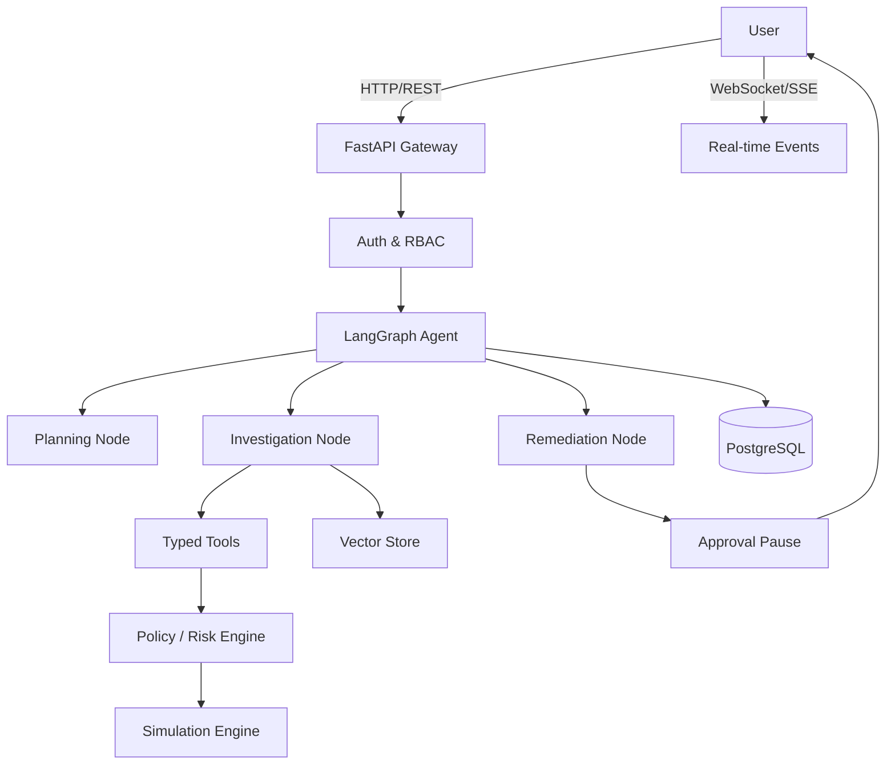

# IncidentPilot Architecture

## Overview
IncidentPilot is an autonomous AI agent system for investigating and remediating production incidents. The system is designed as a stateful, modular monolith focusing on reliability, deterministic authorization, explainability, and observability. 

## High-Level Components

### 1. Frontend (React + TypeScript)
- **Incident Dashboard**: Shows active and historical incidents.
- **Incident Detail View**: Provides timeline, evidence, hypothesis panel, agent trace, and remediation options.
- **Evaluation Dashboard**: Displays metrics (success rate, hallucination rate, median cost/latency).
- **Communication**: Communicates with the backend via REST API and real-time updates (Server-Sent Events/WebSockets).

### 2. Backend (FastAPI + Python)
- **API Layer**: Handles routing, request validation, and HTTP responses.
- **Authentication & RBAC**: Provides JWT-based authentication and role-based access control (VIEWER, ENGINEER, INCIDENT_COMMANDER, ADMIN).
- **Agent Orchestrator (LangGraph)**: Manages the stateful workflow of the investigation.
- **Policy/Risk Engine**: Deterministically validates proposed agent actions against safety and risk rules.
- **Simulation Engine**: A mock production environment for generating realistic logs, metrics, deployments, and handling simulated mutations (rollbacks, restarts).
- **Database Layer**: Manages persistent storage and migrations using PostgreSQL.

### 3. Agent Runtime (LangGraph)
- **State**: A typed Pydantic state model defining the incident, evidence, hypotheses, tool calls, and approval status.
- **Workflow Nodes**:
  - `Intake`: Classify and plan.
  - `Investigate`: Call diagnostic tools, collect evidence.
  - `Hypothesize`: Generate and evaluate competing explanations.
  - `Remediate`: Plan remediation, request approvals for risky actions.
  - `Verify`: Check system recovery.
- **Tools**: Typed interfaces for read-only diagnostics and mutating operations.

### 4. RAG Pipeline (PostgreSQL + pgvector)
- **Storage**: Embeddings and chunked text of runbooks, guides, and policies.
- **Retrieval**: Vector similarity search with metadata filtering.
- **Security boundary**: All retrieved content is treated as untrusted data to prevent prompt injection.

### 5. Storage (PostgreSQL)
- Relational data: Users, incidents, agent runs, tools calls, hypotheses, approvals, and audit logs.
- Vector data: Document embeddings (pgvector).

## Data Flow

